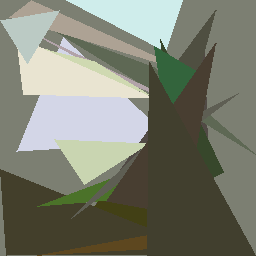
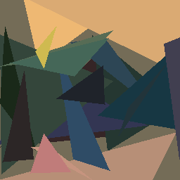
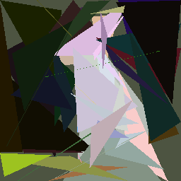
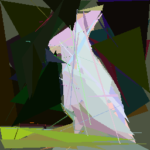
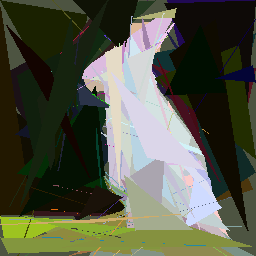

# Abstracta
### Abstract Image Generator  

Generate abstract images using triangles inspired by a target image.  

---

## Installation  

1. Clone the repository:  
   ```bash  
   git clone https://github.com/datavorous/abstracta.git  
   cd abstracta  
   ```  

2. Run the program:  
   ```bash  
   uv run src/main.py  
   ```  

---

## Demo  

Took around 15 minutes with 1200 primitives on my i3-530. 

### Tree Approximation  
  

### Sunset Approximation  
  

### Rabbit Progression  
| 50 Shapes | 100 Shapes | 150 Shapes |  
|-----------|------------|------------|  
|  |  |  |  

---
## Algorithm  

1. **Image Preprocessing**  
   - Load the target image and resize it to 256 x 256 pixels.  
   - Convert the image to an RGB numpy array.  
   - Initialize the current image with the average color of the target image.  

2. **Error Metric**  
   - Compute the Root Mean Square Error (RMSE) between the target image and the current image:  
     RMSE = sqrt((1/n) * Σ (I_target - I_current)^2),  
     where \(n\) is the total number of pixels.  

3. **Triangle Representation**  
   - Each triangle is defined by three vertices \((x1, y1), (x2, y2), (x3, y3)\) and RGB color values \((r, g, b)\).  

4. **Hill Climbing Optimization**  
   - Generate a random triangle.  
   - Calculate its RMSE with the target image when drawn on the current image.  
   - Mutate the triangle's vertices and colors to minimize RMSE.  
   - Select the triangle with the lowest RMSE after multiple iterations.  

5. **Shape Addition**  
   - Draw the best triangle on the current image.  
   - Add the triangle to the list of generated shapes.  

6. **Iteration**  
   - Repeat the optimization and shape addition steps until the specified number of shapes is added.  

7. **Final Image**  
   - Resize the current image to the desired resolution (e.g., 512 x 512).  
   - Save the final abstract image.  
---

## Pseudocode  

```python
# Input: target_image_path, max_shapes, target_resolution
# Output: abstract_image

# Step 1: Load and preprocess the target image
target_image = load_image(target_image_path)
target_image = resize_to(target_image, (256, 256))
current_image = fill_with_average_color(target_image)

# Step 2: Initialize variables
generated_shapes = []

# Step 3: Generate shapes iteratively
for _ in range(max_shapes):
    best_shape = None
    best_score = infinity

    # Step 3.1: Hill climbing to find the best shape
    for _ in range(20):
        shape = generate_random_triangle()
        score = calculate_rmse(current_image, target_image, shape)

        # Local search for better shapes
        for _ in range(50):
            mutated_shape = mutate_triangle(shape)
            mutated_score = calculate_rmse(current_image, target_image, mutated_shape)
            if mutated_score < score:
                shape = mutated_shape
                score = mutated_score

        if score < best_score:
            best_shape = shape
            best_score = score

    # Step 3.2: Add the best shape to the current image
    current_image = draw_triangle(current_image, best_shape)
    generated_shapes.append(best_shape)

    # Save progress periodically
    if iteration % 20 == 0:
        save_image(current_image, f"progress_{iteration}.png")

# Step 4: Resize and save the final image
final_image = resize_to(current_image, (target_resolution, target_resolution))
save_image(final_image, "final.png")
```  

---
